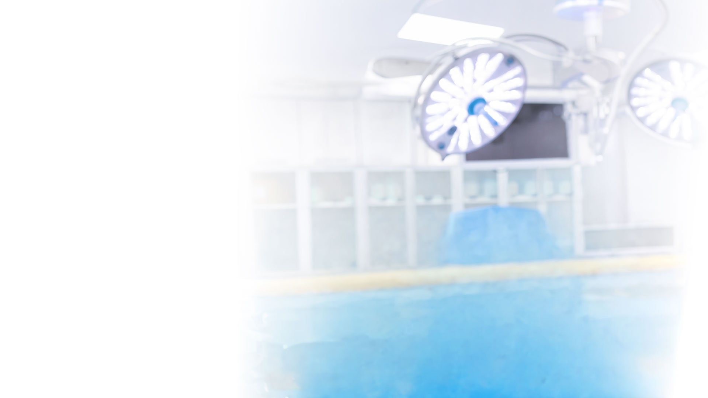
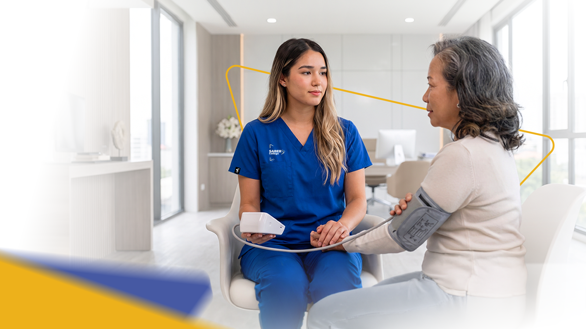
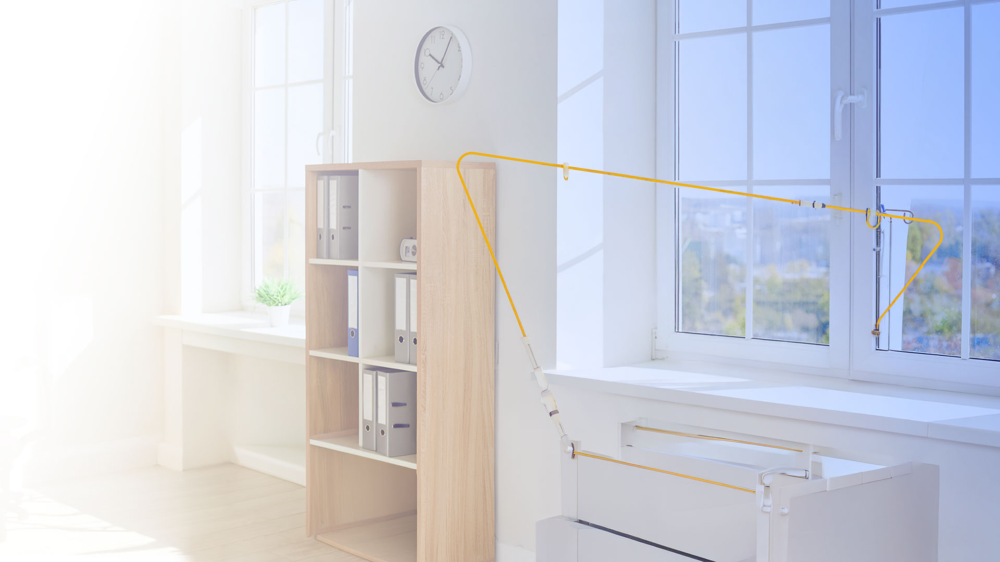

# Catálogo de backgrounds de SABER College

Fecha de revisión: 2026-10-05  
Sitio revisado: WordPress local `http://localhost:8082/`

## Alcance

Este documento reúne las imágenes que actualmente se utilizan como fondo en Elementor y en el CSS del tema hijo. Se revisaron páginas publicadas, privadas y borradores con datos de Elementor, además de `wordpress/wp-content/themes/astra-child/landing-pages.css`.

- Todos los fondos detectados están alojados localmente en `wp-content/uploads`.
- No se encontraron URLs externas configuradas como background en Elementor.
- La revisión inicial no modificó páginas ni recursos; las aplicaciones posteriores se registran en la bitácora de este documento.
- Las imágenes insertadas como widgets normales no se incluyen, salvo las dos imágenes usadas como fondo dentro de las tarjetas de programas del home.

## Resumen

| Grupo | Archivos únicos | Gestión actual |
| --- | ---: | --- |
| Home | 7 | Elementor, biblioteca de medios |
| Design System | 3 | Elementor, SVG reutilizables |
| Otros backgrounds de Elementor | 6 | Elementor, biblioteca de medios |
| Landings `/lp/` | 15 | Reglas en `landing-pages.css` |
| **Total inventariado** | **31** | Todos locales |

## Bitácora de aplicaciones

### 2026-10-06 - Hero de Admissions and Tuition

Se aplicó `Path Light / Open path` al hero de `/admissions-and-tuition/`. Para mantener contraste sobre el fondo claro, el título, la introducción y los párrafos del banner usan ahora los tonos oscuros del Design System. No se modificaron textos, enlaces, botones, estructura ni metadatos SEO.

### 2026-10-05 - Heroes institucionales claros

Se aplicó `Path Light / Open path` como background de los heroes de nueve páginas institucionales: Manuals, Graduation Requirements, Gainful Employment, Faculty, Distance Education, HEERF Historical Reports, Institutional Plans, Safety Plan y CARES Act. El cambio no modificó textos, enlaces, documentos, jerarquía de contenido ni metadatos SEO. Los encabezados blancos de esos banners pasaron a azul institucional para conservar contraste sobre la nueva superficie clara.

## Home

La página de inicio es la referencia visual principal. Usa cinco fondos de sección y dos fondos fotográficos dentro de las tarjetas de programas.

### 1. Hero de salud

| Campo | Valor |
| --- | --- |
| Nombre funcional | Hero clínico claro |
| Media ID | `416` |
| Archivo | [`backgrounnd-banner-hero-home.jpg`](wordpress/wp-content/uploads/2026/08/backgrounnd-banner-hero-home.jpg) |
| Dimensiones | `1920 × 1080`, JPEG |
| Sección | Hero: “Healthcare Career Training in Miami” |
| Elementor | Root `6cc418c`, `cover`, `no-repeat`, `center right`; en móvil `center center` |
| Composición | Espacio blanco a la izquierda y ambiente clínico azul a la derecha |
| Reutilización actual | Home, Professional Nursing Program y Physical Therapist Assistant Program |
| Uso recomendado | Heroes de conversión o programas de salud con texto/formulario a la izquierda |

### 2. Superficie clara de programas

| Campo | Valor |
| --- | --- |
| Nombre funcional | Geometría blanca SABER |
| Media ID | `555` |
| Archivo | [`call_lKJ4lRMzKDwgMzLXVhEeMFWG.png`](wordpress/wp-content/uploads/2026/08/call_lKJ4lRMzKDwgMzLXVhEeMFWG.png) |
| Dimensiones | `1672 × 941`, PNG |
| Sección | “Healthcare Programs” y “Why Choose SABER?” |
| Elementor | Root `657ca59`, `cover`, `no-repeat`, centrado |
| Composición | Blanco con planos triangulares muy suaves inspirados en el logo |
| Reutilización actual | Home, Programs, About Us, Professional Nursing y PTA |
| Uso recomendado | Secciones amplias con tarjetas, programas y contenido denso |

### 3. Tarjeta de Professional Nursing

| Campo | Valor |
| --- | --- |
| Nombre funcional | Nursing card background |
| Media ID | `612` |
| Archivo | [`The-BridgeNurse-A_Land.png`](wordpress/wp-content/uploads/2026/08/The-BridgeNurse-A_Land.png) |
| Dimensiones | `1920 × 1080`, PNG |
| Sección | Tarjeta “Professional Nursing Program (A.S.)” |
| Elementor | Elemento `a9ee4dd`, `cover`, `no-repeat`, `top left` |
| Composición | Enfermera con paciente, área clara lateral y trazo amarillo |
| Reutilización actual | Home y Programs |
| Uso recomendado | Tarjetas o heroes específicamente relacionados con Nursing |

### 4. Tarjeta de Physical Therapist Assistant

| Campo | Valor |
| --- | --- |
| Nombre funcional | PTA card background |
| Media ID | `608` |
| Archivo | [`Saber_PTA_11jun_Land.png`](wordpress/wp-content/uploads/2026/08/Saber_PTA_11jun_Land.png) |
| Dimensiones | `1920 × 1080`, PNG |
| Sección | Tarjeta “Physical Therapist Assistant Program (A.S.)” |
| Elementor | Elemento `8e3277f`, `cover`, `no-repeat`, `top left` |
| Composición | Ejercicio terapéutico, área blanca lateral y trazo amarillo |
| Reutilización actual | Home y Programs |
| Uso recomendado | Tarjetas o heroes específicamente relacionados con PTA |

### 5. Superficie de acompañamiento

| Campo | Valor |
| --- | --- |
| Nombre funcional | Journey glow |
| Media ID | `562` |
| Archivo | [`call_FB4Bt31w20xpQ6iPYUHKeIgI.png`](wordpress/wp-content/uploads/2026/08/call_FB4Bt31w20xpQ6iPYUHKeIgI.png) |
| Dimensiones | `1672 × 941`, PNG |
| Sección | “Find your star / Begin your journey at SABER College” |
| Elementor | Root `d0e11ec`, `cover`, `no-repeat`, centrado |
| Composición | Centro crema claro con halos azules y amarillos en las esquinas |
| Reutilización actual | Home, About Us, Thank You, Professional Nursing y PTA |
| Uso recomendado | Beneficios, pasos, acompañamiento, comunidad y formularios |

### 6. Superficie editorial del blog

| Campo | Valor |
| --- | --- |
| Nombre funcional | Editorial flow |
| Media ID | `574` |
| Archivo | [`call_1BXzmQ66IcvZKJQrMDe2mG1f.png`](wordpress/wp-content/uploads/2026/08/call_1BXzmQ66IcvZKJQrMDe2mG1f.png) |
| Dimensiones | `1672 × 941`, PNG |
| Sección | “Blog Post / Latest News” |
| Elementor | Root `f55cb58`, `cover`, `no-repeat`, centrado |
| Composición | Ondas claras azules, amarillas y violetas con triángulo central |
| Reutilización actual | Home, Blog, Professional Nursing y PTA |
| Uso recomendado | Blog, noticias, recursos y contenido editorial; evitar repetirlo en todas las páginas |

### 7. CTA final

| Campo | Valor |
| --- | --- |
| Nombre funcional | CTA académico claro |
| Media ID | `465` |
| Archivo | [`backgrounnd-banner-call-to-action.jpg`](wordpress/wp-content/uploads/2026/08/backgrounnd-banner-call-to-action.jpg) |
| Dimensiones | `1920 × 1080`, JPEG |
| Sección | “Ready to make a change? Take the first step!” |
| Elementor | Root `d2ec402`, `cover`, `no-repeat`, `center right` |
| Composición | Espacio blanco a la izquierda y ambiente de rehabilitación a la derecha |
| Reutilización actual | Home y Professional Nursing |
| Uso recomendado | CTA de admisiones, solicitud de información o siguiente paso |

### Superficies del home sin imagen

Estas superficies complementan las imágenes anteriores, pero se generan con color CSS y no son archivos independientes.

| Sección | Fondo |
| --- | --- |
| Franja de cuenta regresiva | `#122B8C` |
| “Welcome to SABER College” | `#25377B` |
| Testimonials | `#F3F9FF` |
| Main Highlights | `#FFF8E4` |
| Instagram | `#F3F9FF` |
| FAQ | Blanco / transparente |

## Fondos del Design System

Estos tres SVG son los fondos más seguros para reutilizar en páginas internas. Son ligeros, escalables, no contienen texto y están registrados en la biblioteca de WordPress.

| Nombre | Media ID | Archivo | Apariencia | Aplicaciones / páginas |
| --- | ---: | --- | --- | --- |
| Path Light / Open path | `2064` | [`saber-path-light-v02.svg`](wordpress/wp-content/uploads/saber-design-system/saber-path-light-v02.svg) | Blanco a azul muy claro, halo amarillo y trazos abiertos a la derecha | 29 aplicaciones en 25 páginas; principalmente heroes y secciones claras |
| Path Warm / Warm welcome | `2065` | [`saber-path-warm-v02.svg`](wordpress/wp-content/uploads/saber-design-system/saber-path-warm-v02.svg) | Marfil claro, halo amarillo y diagonales suaves | 17 aplicaciones en 14 páginas; procesos, recursos, apoyo y comunidad |
| Path Navy / Trust field | `2067` | [`saber-path-navy-v02.svg`](wordpress/wp-content/uploads/saber-design-system/saber-path-navy-v02.svg) | Degradado azul oscuro, líneas blancas y acento amarillo | 17 aplicaciones en 12 páginas; confianza, acreditación y cierres |

Los tres archivos miden `1600 × 900` y están disponibles también en la página `/saber-design-system-elementor/`.

### Páginas que usan Path Light

`/student-services/`, `/student-services/saber-survey/`, `/student-services/student-transcript-request/`, `/student-services/career-services/`, `/student-services/academic-affairs/`, `/general/visa-i-20-assistance/`, `/general/tuition-payment-options/`, `/saber-college-accreditation/`, `/apply-to-saber-college/`, `/admissions-and-tuition/`, `/saber_college_programs/physical-therapist-assistant-program/admissions-pta/`, `/saber_college_programs/professional-nursing-program/nursing-admissions/`, `/general/explore-saber-college-gallery/`, `/campus-location/`, `/general/saber_college_leadership/`, `/general/manuals/`, `/general/graduation-requirements/`, `/general/gainful-employment-programs/`, `/general/saber-college-faculty/`, `/general/saber-college-distance-education/`, `/general/heerf-quarterly-reports/`, `/general/institutional-plans/`, `/general/safety-plan/` y `/45-day-report-on-ed-grants/`.

### Páginas que usan Path Warm

`/student-services/`, `/student-services/saber-survey/`, `/student-services/student-transcript-request/`, `/student-services/career-services/`, `/general/visa-i-20-assistance/`, `/general/tuition-payment-options/`, `/saber-college-accreditation/`, `/apply-to-saber-college/`, `/saber_college_programs/physical-therapist-assistant-program/admissions-pta/`, `/saber_college_programs/professional-nursing-program/nursing-admissions/`, `/general/explore-saber-college-gallery/`, `/campus-location/` y `/general/saber_college_leadership/`.

### Páginas que usan Path Navy

`/student-services/student-transcript-request/`, `/student-services/career-services/`, `/student-services/academic-affairs/`, `/general/visa-i-20-assistance/`, `/general/tuition-payment-options/`, `/saber-college-accreditation/`, `/apply-to-saber-college/`, `/saber_college_programs/physical-therapist-assistant-program/admissions-pta/`, `/general/explore-saber-college-gallery/`, `/campus-location/` y `/general/saber_college_leadership/`.

## Otros backgrounds configurados en Elementor

Estos archivos están en uso, pero no forman parte de los siete fondos del home ni de los tres patrones oficiales.

| Media ID | Archivo | Dimensiones | Uso actual | Observación |
| ---: | --- | --- | --- | --- |
| `126` | [`img_Nurse2-scaled.png`](wordpress/wp-content/uploads/2026/08/img_Nurse2-scaled.png) | `2560 × 1429` | Professional Nursing Program | Fondo fotográfico de Nursing |
| `129` | [`lanzamiento-sabri_Landv3.png`](wordpress/wp-content/uploads/2026/08/lanzamiento-sabri_Landv3.png) | `1920 × 1080` | About Us, Professional Nursing y PTA | Recurso institucional con Sabi; revisar el encuadre por página |
| `606` | [`PTA_ago18.png`](wordpress/wp-content/uploads/2026/08/PTA_ago18.png) | `1920 × 1080` | Professional Nursing y PTA | Está configurado como background y overlay en ambas páginas; conviene revisarlo antes de un cambio masivo |
| `610` | [`Saber_Nurse_post_Land_C.png`](wordpress/wp-content/uploads/2026/08/Saber_Nurse_post_Land_C.png) | `1920 × 1080` | Professional Nursing y PTA | Imagen de programa reutilizada en las dos páginas |
| `1308` | [`banner_about_us_01.jpg`](wordpress/wp-content/uploads/2026/09/banner_about_us_01.jpg) | `1920 × 634` | About Us | Banner panorámico institucional |
| `1315` | [`banner_about_us_02.jpeg`](wordpress/wp-content/uploads/2026/09/banner_about_us_02.jpeg) | `1920 × 634` | About Us | Segundo banner panorámico institucional |

## Backgrounds de las landings `/lp/`

Estos fondos están aplicados mediante [`landing-pages.css`](wordpress/wp-content/themes/astra-child/landing-pages.css), líneas 44-58. Aunque el contenido de las landings es editable en Elementor, para sustituir estas imágenes actualmente hay que actualizar la regla CSS correspondiente o migrar el fondo al control nativo de Elementor.

| Landing | Sección | Archivo activo | Dimensiones |
| --- | --- | --- | ---: |
| `/lp/pnp/` | Hero | [`pnp-landing-01-100.jpg`](wordpress/wp-content/uploads/2026/09/pnp-landing-01-100.jpg) | `1499 × 843` |
| `/lp/pnp/` | Overview | [`pnp-landing-02.png`](wordpress/wp-content/uploads/2026/09/pnp-landing-02.png) | `1248 × 892` |
| `/lp/pnp/` | Learn | [`pnp-landing-03.png`](wordpress/wp-content/uploads/2026/09/pnp-landing-03.png) | `1189 × 849` |
| `/lp/pnp/` | Curriculum | [`pnp-landing-04.png`](wordpress/wp-content/uploads/2026/09/pnp-landing-04.png) | `1193 × 852` |
| `/lp/pta/` | Hero | [`therapist-module-01.png`](wordpress/wp-content/uploads/2026/09/therapist-module-01.png) | `1144 × 946` |
| `/lp/pta/` | Overview | [`therapist-module-02.png`](wordpress/wp-content/uploads/2026/09/therapist-module-02.png) | `1048 × 1007` |
| `/lp/pta/` | Learn | [`therapist-module-03.png`](wordpress/wp-content/uploads/2026/09/therapist-module-03.png) | `1016 × 924` |
| `/lp/vesl/` | Hero | [`esol-module-01.png`](wordpress/wp-content/uploads/2026/09/esol-module-01.png) | `899 × 642` |
| `/lp/vesl/` | Overview | [`esol-module-02-100.jpg`](wordpress/wp-content/uploads/2026/09/esol-module-02-100.jpg) | `1465 × 1047` |
| `/lp/vesl/` | Learn | [`esol-module-03.png`](wordpress/wp-content/uploads/2026/09/esol-module-03.png) | `1086 × 1144` |
| `/lp/vesl/` | Curriculum | [`esol-module-04.png`](wordpress/wp-content/uploads/2026/09/esol-module-04.png) | `1131 × 1131` |
| `/lp/medical-assistant-program/` | Hero | [`medical-module-01-100.jpg`](wordpress/wp-content/uploads/2026/09/medical-module-01-100.jpg) | `1183 × 845` |
| `/lp/medical-assistant-program/` | Overview | [`medical-module-02.png`](wordpress/wp-content/uploads/2026/09/medical-module-02.png) | `1128 × 847` |
| `/lp/medical-assistant-program/` | Learn | [`medical-module-03-v2.png`](wordpress/wp-content/uploads/2026/09/medical-module-03-v2.png) | `1272 × 909` |
| `/lp/medical-assistant-program/` | Curriculum | [`medical-module-04.png`](wordpress/wp-content/uploads/2026/09/medical-module-04.png) | `1176 × 840` |

## Guía para futuras sustituciones

1. **No reemplazar un archivo global directamente** si el cambio debe afectar solo una página. Varios Media ID del home también se usan en Programs, About Us y páginas de programa.
2. **Path Light** es la primera opción para heroes internos claros; **Path Warm** para procesos y apoyo; **Path Navy** para confianza, acreditación y cierres.
3. Los fondos fotográficos de Nursing y PTA deben conservar su contexto de programa y el espacio libre previsto para texto.
4. Los fondos `call_...` del home pesan entre aproximadamente 1.1 y 1.6 MB. Antes de extender su uso conviene generar versiones WebP optimizadas, sin borrar los originales.
5. La configuración duplicada de `PTA_ago18.png` en Professional Nursing y PTA merece una revisión visual específica antes de modificarla.
6. Para que las landings sean totalmente editables desde Elementor, conviene trasladar progresivamente las 15 reglas de imagen de `landing-pages.css` al control Background de cada contenedor.

## Criterio visual recomendado

- Mantener entre 60-70% de blanco o superficies muy claras.
- Reservar los fondos fotográficos para heroes, tarjetas de programa y CTA concretos.
- Usar un solo gesto gráfico principal por sección.
- Evitar repetir el mismo background en secciones consecutivas.
- Mantener el azul oscuro como contraste institucional y el amarillo como acento, no como fondo dominante repetido.
